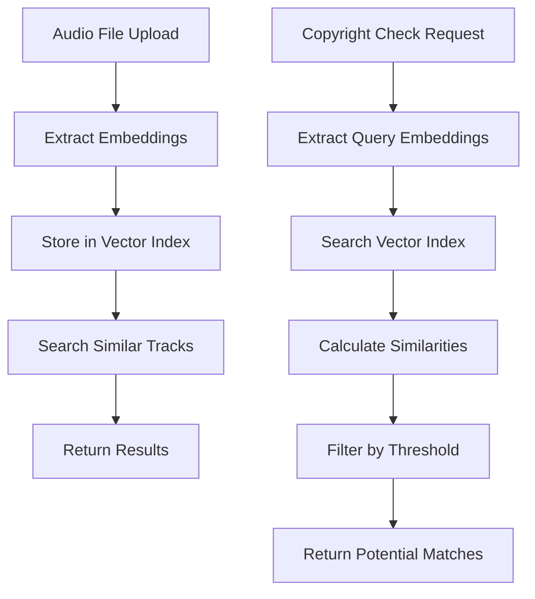

# 🎵 Music Copyright Detection System - Integration Guide

**Created by: Sergie Code - Software Engineer & YouTube Programming Educator**  
**AI Tools for Musicians Series**

This guide provides complete specifications for integrating the Music Embeddings Extraction project with vector search and backend API components to create a comprehensive copyright detection system.

## 🏗️ System Architecture Overview

```
┌─────────────────────────────────────────────────────────────────┐
│                    COPYRIGHT DETECTION SYSTEM                   │
├─────────────────────────────────────────────────────────────────┤
│                                                                 │
│  ┌─────────────────┐    ┌─────────────────┐    ┌─────────────┐  │
│  │   EMBEDDINGS    │    │  VECTOR SEARCH  │    │   BACKEND   │  │
│  │     MODULE      │───▶│     MODULE      │───▶│     API     │  │
│  │   (Python)      │    │   (Python)      │    │  (.NET Core)│  │
│  └─────────────────┘    └─────────────────┘    └─────────────┘  │
│          │                       │                       │      │
│      Audio Files            FAISS Index              REST API   │
│    Extract Features         Fast Search             Web Interface│
│                                                                 │
└─────────────────────────────────────────────────────────────────┘
```

## 📦 Repository Specifications

### 1. copyright-detector-vector-search (Python FAISS Module)

**Purpose**: Efficient vector indexing and similarity search for audio embeddings using FAISS

#### Project Structure
```
copyright-detector-vector-search/
├── src/
│   ├── __init__.py
│   ├── vector_index.py          # FAISS index management
│   ├── search_engine.py         # Search operations
│   ├── index_builder.py         # Index creation and updates
│   └── config.py               # Configuration settings
├── tests/
│   ├── __init__.py
│   ├── test_vector_index.py
│   ├── test_search_engine.py
│   └── test_integration.py
├── examples/
│   ├── build_index_example.py
│   ├── search_example.py
│   └── batch_processing.py
├── notebooks/
│   └── vector_search_demo.ipynb
├── requirements.txt
├── setup.py
├── README.md
└── INTEGRATION.md
```

#### Key Components Required

**1. VectorIndex Class (vector_index.py)**
```python
class VectorIndex:
    """FAISS-based vector index for audio embeddings."""
    
    def __init__(self, dimension: int, index_type: str = 'IVF'):
        """Initialize FAISS index with specified parameters."""
        
    def add_embeddings(self, embeddings: np.ndarray, metadata: List[Dict]):
        """Add embeddings to index with associated metadata."""
        
    def search(self, query_embedding: np.ndarray, k: int = 10) -> List[Dict]:
        """Search for similar embeddings."""
        
    def save_index(self, path: str):
        """Save index to disk."""
        
    def load_index(self, path: str):
        """Load index from disk."""
        
    def get_stats(self) -> Dict:
        """Get index statistics."""
```

**2. SearchEngine Class (search_engine.py)**
```python
class SearchEngine:
    """High-level search interface for music similarity."""
    
    def __init__(self, index_path: str):
        """Initialize with existing index."""
        
    def find_similar_tracks(self, audio_file: str, threshold: float = 0.8) -> List[Dict]:
        """Find tracks similar to input audio file."""
        
    def batch_search(self, audio_files: List[str]) -> Dict[str, List[Dict]]:
        """Perform batch similarity search."""
        
    def detect_potential_matches(self, query_embedding: np.ndarray) -> List[Dict]:
        """Detect potential copyright matches."""
```

**3. IndexBuilder Class (index_builder.py)**
```python
class IndexBuilder:
    """Build and maintain FAISS indices from audio collections."""
    
    def __init__(self, embeddings_extractor):
        """Initialize with embeddings extractor from main module."""
        
    def build_from_directory(self, audio_dir: str, output_path: str):
        """Build index from directory of audio files."""
        
    def update_index(self, new_audio_files: List[str], index_path: str):
        """Update existing index with new files."""
        
    def optimize_index(self, index_path: str):
        """Optimize index for better performance."""
```

#### Integration Points with Embeddings Module

**Import Structure**:
```python
# In vector-search module
import sys
sys.path.append('../copyright-detector-music-embeddings/src')
from embeddings import AudioEmbeddingExtractor
from utils import load_audio, save_embeddings
```

**Configuration for Integration**:
```python
# config.py
EMBEDDINGS_CONFIG = {
    'model_name': 'spectrogram',  # or 'openl3', 'audioclip'
    'embedding_dim': 128,
    'sample_rate': 22050
}

FAISS_CONFIG = {
    'index_type': 'IVF',
    'nlist': 100,
    'metric': 'L2'  # or 'IP' for inner product
}
```

#### Dependencies Required
```
# requirements.txt for vector-search
faiss-cpu>=1.7.4
numpy>=1.21.0
scipy>=1.7.0
pandas>=1.3.0
scikit-learn>=1.0.0
tqdm>=4.62.0
joblib>=1.1.0
```

### 2. copyright-detector-music-backend (.NET Core Web API)

**Purpose**: REST API orchestration layer integrating Python modules for scalable music analysis

#### Project Structure
```
copyright-detector-music-backend/
├── Controllers/
│   ├── AudioAnalysisController.cs
│   ├── SearchController.cs
│   └── IndexController.cs
├── Services/
│   ├── IAudioEmbeddingService.cs
│   ├── AudioEmbeddingService.cs
│   ├── IVectorSearchService.cs
│   ├── VectorSearchService.cs
│   └── PythonScriptService.cs
├── Models/
│   ├── AudioAnalysisRequest.cs
│   ├── SearchRequest.cs
│   ├── SearchResult.cs
│   └── EmbeddingResult.cs
├── Configuration/
│   ├── PythonConfig.cs
│   └── ServiceConfig.cs
├── Scripts/
│   ├── embedding_wrapper.py
│   ├── search_wrapper.py
│   └── requirements.txt
├── Dockerfile
├── docker-compose.yml
├── appsettings.json
├── Program.cs
└── README.md
```

#### Key Components Required

**1. AudioAnalysisController.cs**
```csharp
[ApiController]
[Route("api/[controller]")]
public class AudioAnalysisController : ControllerBase
{
    [HttpPost("extract-embeddings")]
    public async Task<IActionResult> ExtractEmbeddings([FromForm] IFormFile audioFile)
    {
        // Extract embeddings from uploaded audio file
    }
    
    [HttpPost("compare-audio")]
    public async Task<IActionResult> CompareAudio([FromBody] CompareRequest request)
    {
        // Compare two audio files for similarity
    }
}
```

**2. SearchController.cs**
```csharp
[ApiController]
[Route("api/[controller]")]
public class SearchController : ControllerBase
{
    [HttpPost("find-similar")]
    public async Task<IActionResult> FindSimilar([FromForm] IFormFile audioFile)
    {
        // Find similar tracks in database
    }
    
    [HttpPost("copyright-check")]
    public async Task<IActionResult> CopyrightCheck([FromForm] IFormFile audioFile)
    {
        // Check for potential copyright matches
    }
}
```

**3. PythonScriptService.cs**
```csharp
public class PythonScriptService
{
    public async Task<string> RunEmbeddingExtraction(string audioPath)
    {
        // Execute Python embedding extraction script
    }
    
    public async Task<string> RunVectorSearch(string embeddingData, int topK)
    {
        // Execute Python vector search script
    }
}
```

#### Python Integration Scripts

**embedding_wrapper.py** (in Scripts folder):
```python
import sys
import json
import os
sys.path.append('../../copyright-detector-music-embeddings/src')
sys.path.append('../../copyright-detector-vector-search/src')

from embeddings import AudioEmbeddingExtractor
import numpy as np

def extract_embeddings(audio_path, model_name='spectrogram'):
    try:
        extractor = AudioEmbeddingExtractor(model_name=model_name)
        embeddings = extractor.extract_embeddings(audio_path)
        return {
            'success': True,
            'embeddings': embeddings.tolist(),
            'shape': embeddings.shape,
            'model': model_name
        }
    except Exception as e:
        return {
            'success': False,
            'error': str(e)
        }

if __name__ == "__main__":
    audio_path = sys.argv[1]
    model_name = sys.argv[2] if len(sys.argv) > 2 else 'spectrogram'
    result = extract_embeddings(audio_path, model_name)
    print(json.dumps(result))
```

**search_wrapper.py** (in Scripts folder):
```python
import sys
import json
import numpy as np
sys.path.append('../../copyright-detector-vector-search/src')

from search_engine import SearchEngine

def search_similar(embedding_data, index_path, top_k=10):
    try:
        search_engine = SearchEngine(index_path)
        embedding = np.array(json.loads(embedding_data))
        results = search_engine.detect_potential_matches(embedding)
        return {
            'success': True,
            'results': results[:top_k]
        }
    except Exception as e:
        return {
            'success': False,
            'error': str(e)
        }

if __name__ == "__main__":
    embedding_data = sys.argv[1]
    index_path = sys.argv[2]
    top_k = int(sys.argv[3]) if len(sys.argv) > 3 else 10
    result = search_similar(embedding_data, index_path, top_k)
    print(json.dumps(result))
```

#### Configuration Files

**appsettings.json**:
```json
{
  "PythonConfig": {
    "PythonPath": "python",
    "ScriptsPath": "./Scripts",
    "EmbeddingsRepoPath": "../copyright-detector-music-embeddings",
    "VectorSearchRepoPath": "../copyright-detector-vector-search"
  },
  "VectorSearch": {
    "IndexPath": "./data/music_index.faiss",
    "DefaultTopK": 10,
    "SimilarityThreshold": 0.8
  },
  "FileUpload": {
    "MaxFileSizeMB": 50,
    "AllowedExtensions": [".wav", ".mp3", ".flac", ".m4a"],
    "UploadPath": "./uploads"
  }
}
```

## 🔗 Integration Workflow

### 1. End-to-End Process Flow



### 2. Data Flow Between Components

**Embeddings → Vector Search**:
```python
# Extract embeddings
extractor = AudioEmbeddingExtractor()
embeddings = extractor.extract_embeddings('song.wav')

# Add to vector index
index = VectorIndex(dimension=128)
index.add_embeddings(embeddings, metadata={'file': 'song.wav'})

# Search for similar
results = index.search(query_embedding, k=10)
```

**Python → .NET API**:
```csharp
// C# calling Python script
var result = await _pythonService.RunEmbeddingExtraction(audioPath);
var embeddingData = JsonSerializer.Deserialize<EmbeddingResult>(result);

// Use embeddings for search
var searchResult = await _pythonService.RunVectorSearch(
    JsonSerializer.Serialize(embeddingData.Embeddings), 
    _config.IndexPath, 
    10
);
```

## 🚀 Development Instructions for AI Agents

### For copyright-detector-vector-search Repository:

1. **Initialize Python project** with the specified structure
2. **Implement FAISS integration** for efficient vector operations
3. **Create comprehensive search capabilities** with similarity thresholds
4. **Add index management** (build, update, optimize, persist)
5. **Include batch processing** for large datasets
6. **Integrate with embeddings module** using relative imports
7. **Add performance optimizations** (GPU support, index tuning)
8. **Create example scripts** for common use cases
9. **Write comprehensive tests** for all functionality
10. **Add Jupyter demo** showing vector search capabilities

### For copyright-detector-music-backend Repository:

1. **Create .NET Core Web API project** with specified structure
2. **Implement REST endpoints** for audio analysis and search
3. **Add Python script integration** via Process execution
4. **Create file upload handling** with validation
5. **Implement async operations** for better performance
6. **Add comprehensive error handling** and logging
7. **Create Docker support** for easy deployment
8. **Add API documentation** with Swagger/OpenAPI
9. **Implement authentication** and rate limiting
10. **Add monitoring and health checks**

## 🎯 Success Criteria

### Vector Search Module:
- ✅ Fast similarity search (<100ms for 1M vectors)
- ✅ Scalable index building and updates
- ✅ Integration with embeddings module
- ✅ Comprehensive test coverage
- ✅ Production-ready error handling

### Backend API:
- ✅ RESTful endpoints for all operations
- ✅ File upload and processing
- ✅ Python integration working smoothly
- ✅ Docker containerization
- ✅ API documentation and testing

## 📚 Usage Examples

### Complete System Integration:

```bash
# 1. Build vector index from music collection
cd copyright-detector-vector-search
python examples/build_index_example.py --input-dir /music/collection --output index.faiss

# 2. Start the backend API
cd copyright-detector-music-backend
dotnet run

# 3. Use the API for copyright detection
curl -X POST "http://localhost:5000/api/search/copyright-check" \
     -H "Content-Type: multipart/form-data" \
     -F "audioFile=@suspicious_song.mp3"
```

## 🎓 Educational Notes by Sergie Code

This integration demonstrates several important software engineering concepts:

1. **Microservices Architecture**: Separate concerns across specialized modules
2. **Language Interoperability**: Python for ML, .NET for web services
3. **Vector Databases**: Modern approach to similarity search at scale
4. **API Design**: RESTful services for music analysis
5. **Production Deployment**: Docker, monitoring, and error handling

Perfect for teaching modern software development practices to musicians interested in AI tools!

---

**Created by Sergie Code**  
*Software Engineer & Programming Educator*  
*AI Tools for Musicians Series*

**Repository**: `copyright-detector-music-embeddings`  
**Date**: August 29, 2025  
**Version**: 1.0.0
